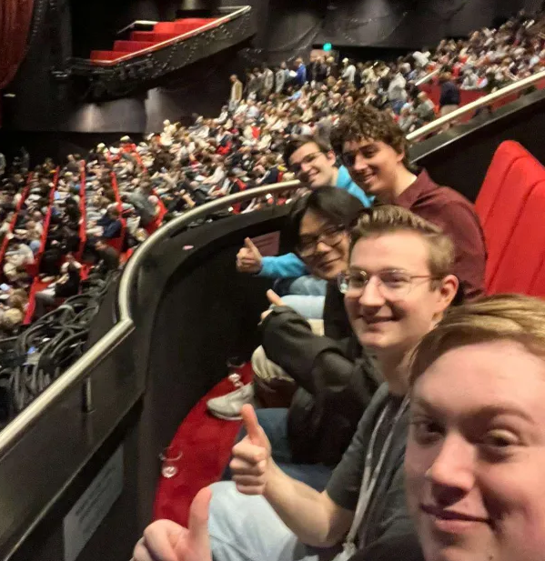

# HBO-I Event – 2 oktober 2025

Op 2 oktober 2025 bezocht ik samen met de opleiding ID de HBO-I stagebeurs in Utrecht. Het doel van deze dag was om bedrijven te ontmoeten, meer inzicht te krijgen in verschillende IT-richtingen en mogelijke stageplekken te vinden die passen bij mijn interesses en toekomstplannen. Tijdens het event sprak ik met meerdere organisaties en volgde ik een workshop die relevant is voor mijn ontwikkeling richting.

## Cursus: Docker Containers – Berry Langerak (Tilaa)

Tijdens de stagebeurs heb ik ervoor gekozen om een cursus over Docker te volgen, gegeven door Berry Langerak, CTO van Tilaa. Ik heb voor deze cursus gekozen omdat ik nog moeite had met het opzetten van Docker-containers en met het begrijpen van hoe containers precies werken.

Tijdens de cursus werd uitgelegd:

- hoe je Docker-containers opzet;
- waarom containerisatie belangrijk is binnen moderne IT;
- hoe bedrijven containers inzetten voor deployment en schaalbaarheid.

Deze kennis helpt mij gerichter te zoeken naar stageplekken op het gebied van DevOps, cloud en infrastructuur, omdat ik nu beter begrijp welke technologieën binnen deze richtingen worden gebruikt.

## Quintor – Softwareontwikkeling & Consultancy

Quintor is een IT-consultancybedrijf dat projecten ontwikkelt voor klanten. Hierbij maken zij veel gebruik van Java, .NET en frontendtechnologieën. Daarnaast werken zij volgens de Agile Scrum-methode. Dit sluit goed aan bij mijn interesses, omdat ik het leuk vind om aan projecten te werken en mijzelf later ook zie werken binnen een consultancybedrijf.

## Capgemini – IT Consultancy

Capgemini is een IT-consultancybedrijf dat projecten ontwikkelt voor klanten. Zij gaven aan dat zij voornamelijk werken met Java en .NET, en dat er binnen het bedrijf veel focus ligt op zelfstandigheid en eigen verantwoordelijkheid. Ik vind Capgemini een interessant bedrijf, mede omdat het dichtbij mijn woonplaats is gevestigd. Daarnaast waren beide van mijn ouders werkzaam bij Capgemini, waardoor ik al enige bekendheid heb met het bedrijf.

## Netcompany – IT Consultancy

Netcompany is een IT-consultancybedrijf dat organisaties helpt met softwareontwikkeling en digitale oplossingen. Ze bieden stages aan waarbij je meewerkt aan echte projecten en ervaring opdoet met programmeren, projectmatig werken en klantcontact. Ik vond Netcompany een interessant bedrijf, omdat het goed aansluit bij mijn interesse in softwareontwikkeling en het werken aan verschillende projecten.

## ProRail – Data Science & Data Engineering

ProRail is het nationale spoorwegbedrijf van Nederland en biedt ook IT-gerichte stages aan. Deze stages zijn vooral gefocust op data, zoals data science en data engineering. Hoewel ProRail een interessant en groot bedrijf is, past dit minder goed bij mij, omdat mijn interesses niet liggen bij data science of data engineering.

## Wentzo – IoT

Wentzo is een IoT-bedrijf dat gespecialiseerd is in het opzetten en beheren van wifi-netwerken. Zij hebben bijvoorbeeld voor de wifi-infrastructuur in het HBO-I event geregeld. Dit vond ik interessant om te horen, maar het paste minder goed bij mijn interesses, omdat ik mij meer wil richten op softwareontwikkeling dan op netwerk- of IoT-oplossingen.

## Conclusie

De HBO-I stagebeurs was waardevol voor mijn zoektocht naar een stageplek. Door met verschillende bedrijven in gesprek te gaan, kreeg ik een duidelijker beeld van wat ik wel en niet zoek in een stage. Hierbij kwam ik tot de conclusie dat mijn interesse meer ligt bij IT-consultancy dan bij data science of IoT.

De cursus was interessant, maar bevatte helaas niet veel volledig nieuwe informatie voor mij. Wel waren de praktische tips en tricks die Berry Langerak gaf over het snel en correct opzetten van Docker-containers erg nuttig en direct toepasbaar.

Dankzij deze dag weet ik beter welke bedrijven en soorten stages aansluiten bij mijn leerdoelen.
